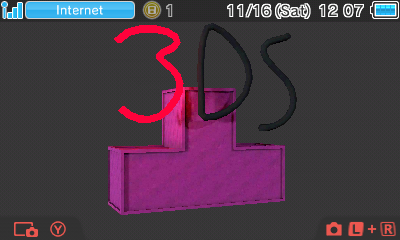

:license-badge: https://img.shields.io/badge/license-MIT-blue.svg

:cpp11-badge: https://img.shields.io/badge/standard-C%2B%2B%2011-blue.svg?logo=C%2B%2B
:isocpp: https://isocpp.org

:azure-badge: https://dev.azure.com/3DStris/3DStris/_apis/build/status/3DStris.3DStris?branchName=master
:azure-latest: https://dev.azure.com/3DStris/3DStris/_build/latest?definitionId=1&branchName=master

:downloads-badge: https://img.shields.io/github/downloads/3DStris/3DStris/total
:latest-release: https://github.com/3DStris/3DStris/releases/latest

:codefactor-badge: https://www.codefactor.io/repository/github/3DStris/3DStris/badge
:codefactor: https://www.codefactor.io/repository/github/3DStris/3DStris

:weblate-badge: https://hosted.weblate.org/widgets/3dstris/-/svg-badge.svg
:weblate: https://hosted.weblate.org/engage/3dstris/
:weblate-homepage: https://weblate.org

:imagesdir: ./data/screenshots

ifdef::env-github[]
:caution-caption: :fire:
:important-caption: :exclamation:
:note-caption: :paperclip:
:tip-caption: :bulb:
:warning-caption: :warning:
endif::[]

= 3DStris image:{license-badge}[MIT, link=LICENSE] image:{cpp11-badge}[C\+\+ 11, link={isocpp}] image:{azure-badge}[Azure Pipelines, link={azure-latest}] image:{downloads-badge}[GitHub release downloads, link={latest-release}] image:{codefactor-badge}[CodeFactor, link={codefactor}] image:{weblate-badge}[Weblate, link={weblate}]
:toc: preamble

A Tetris clone for the 3DS.

== Downloads
:tinydb: https://tinydb.eiphax.tech
:stats: https://3dstris.geni.site

[%hardbreaks]
The latest automatically generated stable build can be found {latest-release}[here].
Development builds are available as Azure Pipelines artifacts. You can find the latest development build {azure-latest}[here].
3DStris is also available on {tinydb}[TinyDB].
You can view the GitHub release stats {stats}[here].

== Screenshots
image:mainmenu.png[Main Menu, 404, 485]
image:sprint.png[Sprint, 404, 485]
image:ingame.png[Ingame, 404, 244]

== Building
:devkitpro-setup: https://www.3dbrew.org/wiki/Setting_up_Development_Environment
:cmake: https://cmake.org/download
:makerom: https://github.com/jakcron/Project_CTR
:bannertool: https://github.com/Steveice10/bannertool

=== Setup
For building you'll need to {devkitpro-setup}[set up devkitPro] and you'll need to have the following tools in your `PATH`:

* {cmake}[CMake >= 3.12]
* {bannertool}[bannertool]
* {makerom}[makerom]

Make sure to clone recursively (required for third-party libs, check `external/`):
[source, bash]
----
git clone --recursive https://github.com/3DStris/3DStris
# If you've already cloned without --recursive, do:
git submodule update --init
----

=== Commands
IMPORTANT: On Windows, the following commands should be run in the devkitPro shell (`devkitPro/msys2/usr/bin/bash.exe`).
[source,bash]
----
cmake -G "Unix Makefiles" -S . -B build
cmake --build build
# or if your CMake version isn't new enough
mkdir build && cd build
cmake -G "Unix Makefiles" ..
make
----
Resulting binaries can be found in `build/bin/`.

== Translation
3DStris uses {weblate-homepage}[Weblate] for its translations. Feel free to contribute or view existing translations at {weblate}[the Hosted Weblate instance].

Pre-Weblate integration credits:

* German - https://github.com/itsdavvid[@itsdavvid]
* Polish - https://github.com/itsdavvid[@itsdavvid]
* (Brazilian) Portuguese - https://github.com/matcool[@matcool]
* Russian - https://github.com/oatmealine[@oatmealine]
* Japanese - https://github.com/Epicpkmn11[@Epicpkmn11]
* French - https://github.com/badablek[@badablek]
* Danish - https://github.com/AlbertCoolGuy[@AlbertCoolGuy]

== License
Distributed under the MIT license. See the accompanying link:LICENSE[LICENSE] file for more information.
