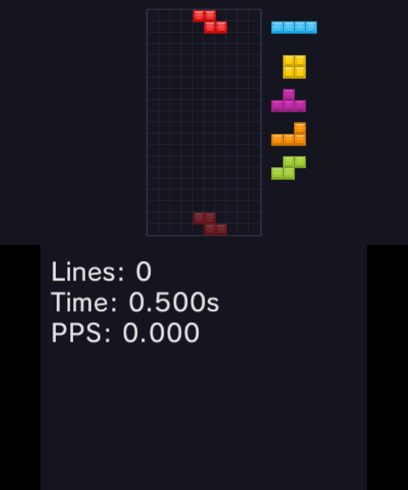
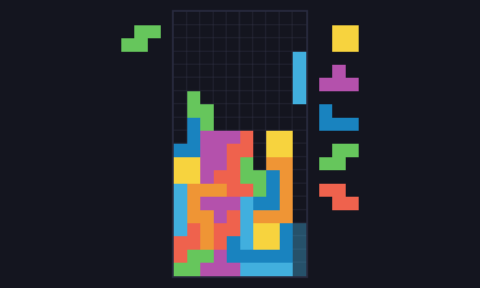

# 3DStris [![Build Status][travis-badge]][travis-url] [![CodeFactor][codefactor-badge]][codefactor-url]
Basic Tetris clone for the 3DS.

<p float="left">
	
	
	
	
</p>

# Downloads
Automatically generated builds can be found [here][releases-url].  
3DStris is also available on [TinyDB][tinydb-url].

# Building
## Setup
For building [you'll need to set up devkitPro][devkitpro-setup], CMake >= 3.12 and you'll need to have the following tools in your `PATH`:
- [bannertool][bannertool-url]
- [makerom][makerom-url]

Make sure to clone recursively (required for third-party libs, check `lib/`):
```bash
git clone --recursive https://github.com/3DStris/3DStris
# Or if you've already cloned
git submodule update --init
```
## Commands
*On Windows, the following commands should be run in devkitPro's shell `devkitPro/msys2/usr/bin/bash.exe`.*
```bash
mkdir build && cd build
cmake -G "Unix Makefiles" .. # Use "Unix Makefiles" to avoid using MSVC on Windows
make
```
Binaries can be found in `build/apps/`.

# Translation
3DStris currently has translations available for the following languages:
* English
* Bulgarian by @geniiii
* German by @itsdavvid
* Polish by @itsdavvid
* (Brazilian) Portuguese by @matcool
* Russian by @oatmealine
* Japanese by @Epicpkmn11
* Macedonian by @geniiii

[devkitpro-setup]: https://www.3dbrew.org/wiki/Setting_up_Development_Environment
[makerom-url]: https://github.com/jakcron/Project_CTR
[bannertool-url]: https://github.com/Steveice10/bannertool
[releases-url]: https://github.com/3DStris/3DStris/releases
[travis-badge]: https://travis-ci.org/3DStris/3DStris.svg?branch=master
[travis-url]: https://travis-ci.org/3DStris/3DStris
[codefactor-badge]: https://www.codefactor.io/repository/github/3dstris/3dstris/badge
[codefactor-url]: https://www.codefactor.io/repository/github/3dstris/3dstris
[tinydb-url]: https://tinydb.eiphax.tech
